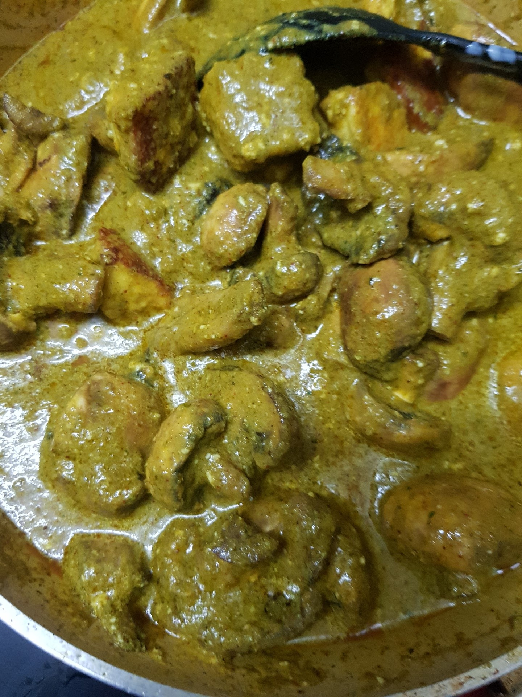
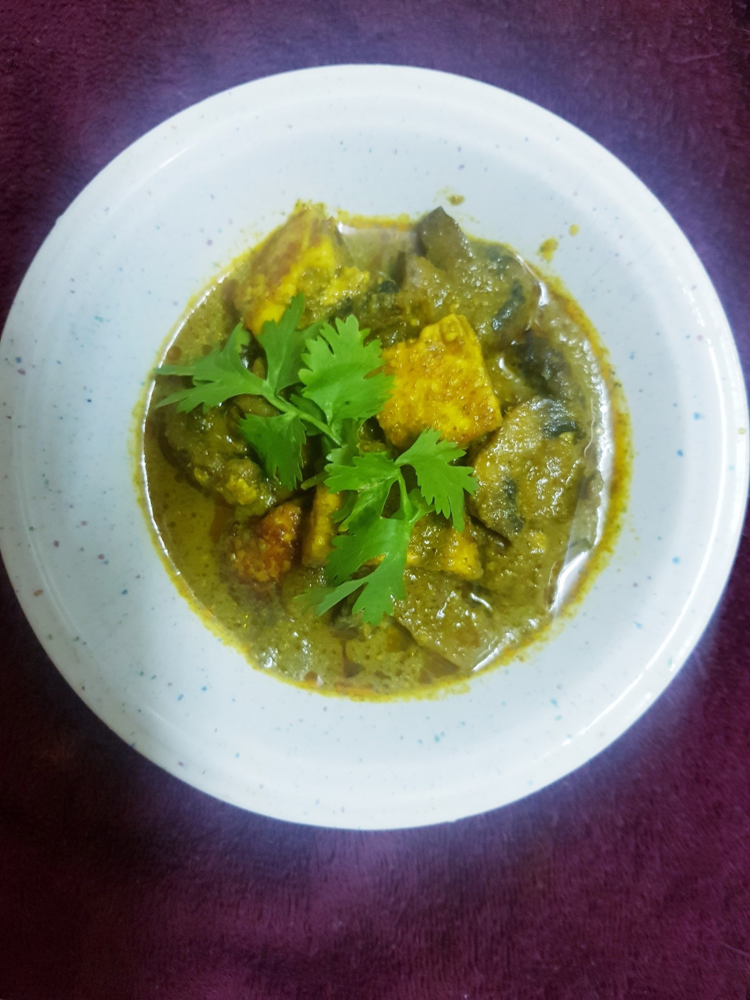

Paneer Mashroom green masala 225gm mashroom cleaned and cut into half 225 gm paneer ,cut into cubes  Oil or ghee 4 tbsp
Turmeric powder 1tsp
Chilli powder 1tsp
Garam masala 1tsp
Salt 1 tsp or to taste
3/4 cup yogurt ,beaten
For masala:50 gm /3/4 cup fresh  coriender ,chopped
1/4cup fresh mint leaves,chopped
85gm/1 onion ,roughly sliced
3 green chillies,chopped
6 medium garlic cloves
1" piece fresh ginger ,chopped
Grind the ingredients listed in masala to smooth paste.

Heat oil or ghee in a frying pan and fry the paneer cubes until they golden brown.remove and keep aside.

In the same pan , Add ground paste fry for 1 minute,add Turmeric powder 1tsp Chilli powder 1tsp
Garam masala 1tsp
Salt 1 tsp or to taste fry till oil seprates.

Switch off flame add mashrooms,fried paneer,beaten yogurt,and 1/4 cup water mix well.

switch on flame cover and cook on slow flame for about 10 minutes or oil floats on top.

garnish with spring of coriender and serve hot.

